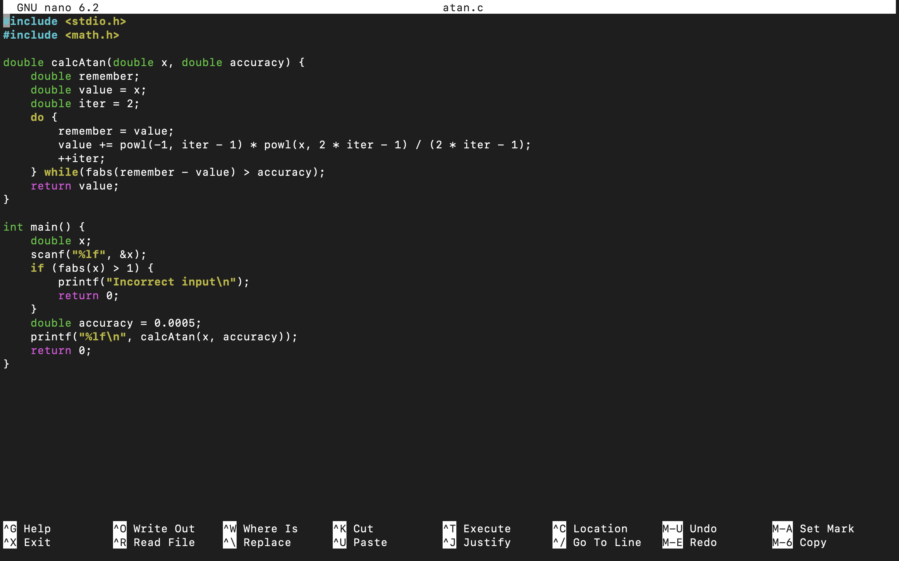
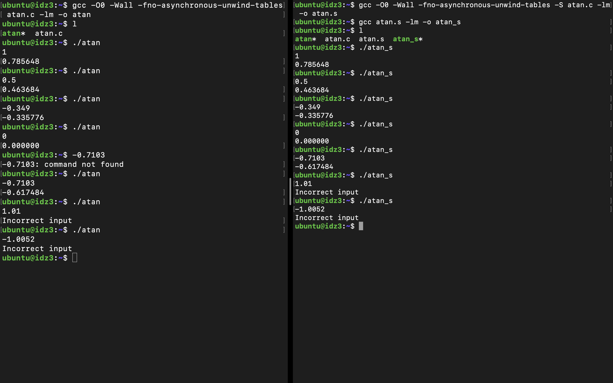
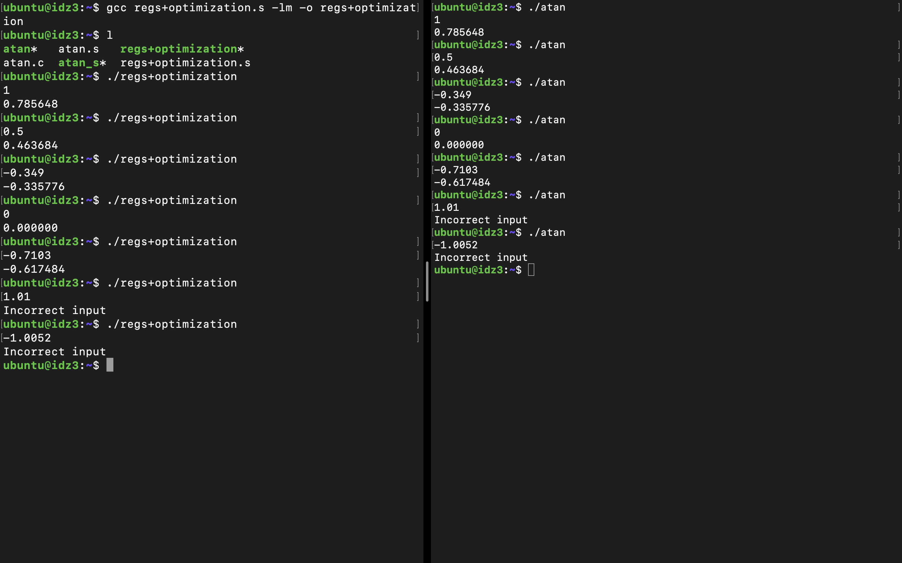

# Архитектура вычислительных систем

## Индивидуальное домашнее задание №3

### Швецов Данил Игоревич, БПИ219

#### Вариант 9
Задание: Разработать программу, вычисляющую с помощью степенного ряда с точностью не хуже 0,05% значение функции arctan(x) для заданного параметра x.

## Отчет

### Данное индивидуальное домашнее задание выполнено на оценку 6. 

* Написанное решение программы на C:
>

* Программа откомпилирована без оптимизирующих и отладочных опций, убраны 
лишние макросы за счет использования соответствующих аргументов командной 
строки с помощью следующих инструкций интерпретатора и ручного модифицирования:
    * $ gcc -O0 -Wall -fno-asynchronous-unwind-tables atan.c -lm -o atan
    * $ gcc -O0 -Wall -fno-asynchronous-unwind-tables -S atan.c -lm -o atan.s
    * $ gcc atan.s -lm -o atan_s

  В результате получены 2 исполняемые программы "atan" и "atan_s", которые можно 
запустить из той же директории с помощью команд:
  * ./atan
  * ./atan_s

  Приведем примеры тестовых покрытий для обеих программ:
  >
  
    Затем представлено полное тестовое покрытие, дающее одинаковый результат 
на обеих программах. Проанализировав полученные результаты, можно сделать 
вывод, что выполняется условие эквивалентности функционирования двух 
программ, и все работает корректно.

* Также мной был произведен рефакторинг программы на ассемблере за счет дополнительной ручной оптимизации, связанной с использованием регистров процессора вместо обращения к памяти (в регистры были перенесены не все переменные, что предположительно может ускорить выполнение программы). Соответственно, было произведено добавление данной программы к уже представленным, а также были добавлены комментарии в разработанную программу, поясняющие эквивалентное использование регистров вместо переменных исходной программы на C. С результатами выполненной работы можно ознакомиться в файле "regs+optimization.s".
Скомпилировать данную программу можно с помощью следующей инструкции интерпретатора:
    * $ gcc regs+optimization.s -lm -o regs+optimization
  
    Ниже представлено полное тестовое покрытие данной программы. Проанализировав полученные результаты, можно сделать 
вывод, что выполняется все работает корректно.
>

Теперь сопоставим размеры программы на ассемблере полученной после компиляции с языка C с модифицированной программой, использующей регистры. Для того, чтобы это осуществить, введем команду:
* $ ls -lh (данные о размере будут в Кб, можно использовать ls -all для информации об объеме в байтах)

которая выведет подробную информацию о файлах в текущей директории, в том числе и удобочитаемый размер. 

Обратим внимание на результат (сопоставляем программы на уровне объектных и бинарных (исполняемых) файлов):
* atan_s.out -> 16144 bytes
* regs+optimization.out -> 16144 bytes
* atan_s.o -> 2216 bytes
* regs+optimization.o -> 1888 bytes

